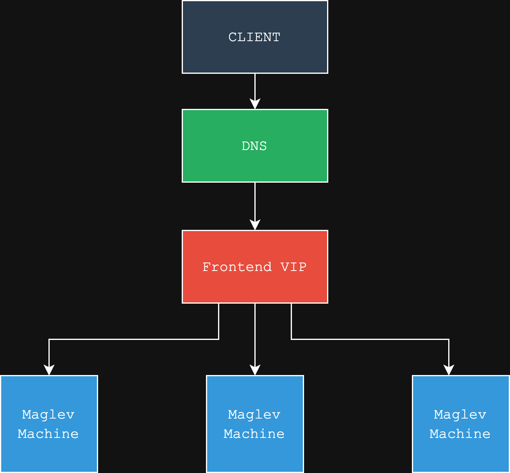

# Load Balancing

## What is load balancing?

A load balancer distributes application traffic to different server endpoints.

### Benefits

High spikes in compute load can cause internal servers to lag or cause inconsistent responses. Load balancers improve the availability, scalability, security (can send information to different backends and localize the effect of an attack on an entire system), and performance.

### Algorithms

#### Static
Uses set rules to assign packets to backend servers.

Examples:
- **Round Robin**: Distributes requests sequentially across servers
- **Random**: Random selection
- **IP Hash**: Assigns based on IP

#### Dynamic
Makes decisions based on real-time information about system load, response times, and health.

Examples:
- **Least Connection**: Connect to server with fewest connections
- **Weighted Round Robin**: Assigns servers based on weightings
- **Predictive**: Uses historical data and trends to anticipate load

### Different Types of Load Balancers

The OSI model describes the different levels of network communication. Load balancers generally operate at Layer 4 (transport) and Layer 7 (application).

**Layer 4 load balancers**: A deployment where the accessible IP address refers to the load balancer's IP address. When receiving the request, the load balancer changes the destination IP to its selected end server.

**Layer 7 load balancer**: Distributes information based on data found in application layer HTTP headers, cookies, etc. Allows routing decisions based on given parameters.

# Maglev - Google's Distributed System Specification

## Implementation

Explanation of the simplified rendition found within `maglev` focusing on core topics.

### System Design

*High-level architecture*

### Maglev Machine

Composed of a Controller and Forwarder and in charge of a set of IP servers.

### Controller

Performs periodic health checks for the forwarder. Depending on the health, the forwarder will cut off connection of the Maglev machine to the VIP.

### Forwarder

Responsible for forwarding packets to particular backends. Creates a hash from packet specifications. First, it checks the local connection tracking table. If found within the table, it returns the associated backend. Otherwise, it uses a consistency hash table to associate a backend with the packet and saves this in the connection tracking table.

#### Connection Tracking

A hash table mapping a tuple to a particular backend. When we receive a tuple with the same configuration as we've already seen, it will be stored in our connection tracking table. This allows for session persistence even if our consistency hashing changes.

### Consistency Hash

Creates a large hash table with 100x the amount of backends we have. Creates a preference ordering for each backend for the indexes found within the hash table. In Round Robin fashion, it iteratively assigns hash table indexes to a specific backend according to preference lists.

Importantly, our consistency hash table is shared across all Maglev machines so that we have a high likelihood of hitting the same backend resource for a given packet with the same configuration across our tables. Hence the "consistency" in consistency hash.

The Maglev Hashing algorithm balances load across backends while also causing minimal disruptions due to backend changes thanks to the algorithm used for population.

# Pertinent Concepts

Before speaking purely to the theory, important networking and Linux concepts and their relevance are defined here.

## Network Interface Card

Hardware to connect a computer to a network, responsible for low-level connection and handling.

**Relevance**: NIC is used for packet processing. Bypass the kernel (explained below) allowing direct interaction with the NIC.

## Generic Routing Encapsulation (GRE)

IP protocol placing one packet inside another.

**Relevance**: After selecting a backend with a Maglev machine, the original packet is encapsulated with a new IP header. Allows us to preserve the original packet.

## Direct Server Return

When sending information back to the client, instead of moving in some reverse direction back through the load balancer, we completely circumvent it and instead return directly to the client.

**Relevance**: Maglev is bypassed on the return trip.

## Border Gateway Protocol (BGP)

Protocol to exchange information between autonomous systems on the internet.

**Relevance**: Used by controller to cut off connection of Maglev machine to particular IP.

# Theory

The theoretical underpinnings of the Maglev architecture are discussed in greater detail here.

For complete understanding, reference the original paper found within the references.

## ECMP (Equal Cost Multipath)

Each VIP has a set of attached Maglev Machines. ECMP is the algorithm used to evenly distribute packets to all Maglev Machines.

## Kernel Bypass

Maglev originally used Linux kernel stack for packet processing. Intuitively, the effects of a particular resource were not being taken advantage of. They incorporate a mechanism to skip this stage of the packet processing process and achieve 5x throughput.

## Forwarder Architecture

Receives information from network interface card, performs processing and sends back. Importantly, Linux kernel is bypassed here.

Packets received are sent to steering module which then assigns packets to particular thread queues from a 5-tuple hash based on the packet specification. The connection tracking table and consistent hashing table are similar to our implementation but for each thread instead.

# Next Steps
- Incorporate pure theory concepts into implementation
- Read paper
- Learn an adjacent concept

# References

Maglev Paper - https://static.googleusercontent.com/media/research.google.com/en//pubs/archive/44824.pdf